# Documentation Index for Martin C Scott Website

This file serves as a central reference point for all documentation files in the Martin C Scott website project. It provides an overview of each documentation file's purpose and how they relate to each other.

## Documentation File Structure

```
/Docs
├── DOCUMENTATION.md          # Main overview of the project and its structure
├── CONTRIBUTING.md           # Guidelines for contributing to the project
├── COMPONENTS.md             # Detailed documentation of all UI components
├── WORDPRESS-INTEGRATION.md  # In-depth explanation of WordPress API integration
├── STYLING.md                # Comprehensive guide to the styling system
├── DARK-MODE.md              # Detailed documentation of dark mode implementation
├── SEO.md                    # Documentation of SEO implementation and best practices
├── DEPLOYMENT.md             # Instructions for deploying the website
├── CONTACT-FORM.md           # Documentation of contact form implementation
└── DOCUMENTATION-INDEX.md    # This file
```

## Relationship Between Documentation Files

```mermaid
graph TD
    A[DOCUMENTATION.md] --> B[Main overview and project structure]
    A --> C[Entry point for understanding the project]
    
    D[CONTRIBUTING.md] --> E[Guidelines for contributing]
    D --> F[Development workflow]
    D --> G[Code style and testing guidelines]
    
    H[COMPONENTS.md] --> I[Detailed component documentation]
    H --> J[Props, usage examples, and implementation details]
    
    K[WORDPRESS-INTEGRATION.md] --> L[WordPress API integration details]
    K --> M[Data fetching and pagination implementation]
    
    N[STYLING.md] --> O[Tailwind configuration]
    N --> P[Color schemes, typography, and responsive design]
    
    Q[DARK-MODE.md] --> R[Dark mode implementation]
    Q --> S[User preference persistence and system integration]
    
    T[SEO.md] --> U[SEO implementation]
    T --> V[Meta tags, heading structure, and best practices]
    
    W[DEPLOYMENT.md] --> X[Deployment instructions]
    W --> Y[Hosting platform-specific configurations]
    
    Z[CONTACT-FORM.md] --> AA[Contact form implementation]
    Z --> AB[EmailJS integration and Cloudflare Turnstile]
```



## How to Use This Documentation

1. **Start with DOCUMENTATION.md** - This is your main entry point and provides an overview of the entire project.
2. **Check CONTRIBUTING.md** - If you plan to contribute to the project, this file contains essential guidelines.
3. **Explore specific documentation files** - Dive into the files that match your interests or needs:
   - COMPONENTS.md for UI component details
   - WORDPRESS-INTEGRATION.md for blog-related implementation
   - STYLING.md for styling system information
   - DARK-MODE.md for dark mode specifics
   - SEO.md for SEO implementation details
   - DEPLOYMENT.md for deployment instructions
   - CONTACT-FORM.md for contact form implementation

4. **Refer to this DOCUMENTATION-INDEX.md** - Use this file as a reference to understand how all documentation files fit together.

## Documentation Navigation

Each documentation file includes links to related files for easy navigation. You can also use this index as a central hub to jump to any specific documentation file.

## Documentation Updates

As the project evolves, this index will be updated to reflect any changes in the documentation structure or content. Always check this file for the most current information on how to navigate the documentation.
