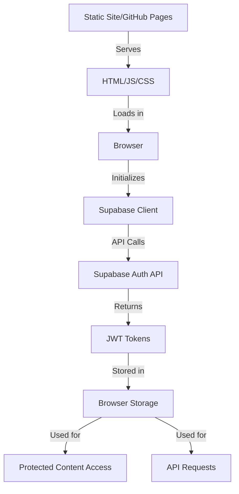

# Supabase Authentication in Static Sites: Executive Summary

## Overview

This document provides an executive summary of the Supabase authentication implementation in the Martin C Scott portfolio website, a static site deployed to GitHub Pages. It consolidates key findings from the detailed analysis documents and presents a concise overview of the architecture, security considerations, and recommendations.

## Authentication Architecture

### Key Characteristics

- **Static Site Deployment**: All authentication happens client-side after the site loads
- **No Server Processing**: No server-side code to enforce authentication rules
- **API-Based Authentication**: Direct communication between browser and Supabase
- **Client-Side Protection**: Protected routes rely on JavaScript redirects

## Security Assessment

| Aspect | Rating | Notes |
|--------|--------|-------|
| Authentication Implementation | ⭐⭐⭐☆☆ | Solid implementation with some security gaps |
| Data Protection | ⭐⭐☆☆☆ | Relies on client-side checks without clear RLS policies |
| Token Management | ⭐⭐⭐☆☆ | Standard JWT implementation with localStorage storage |
| Protected Routes | ⭐⭐☆☆☆ | Client-side only protection with redirect pattern |
| Error Handling | ⭐⭐⭐☆☆ | Good error handling but exposes some details |

### Primary Security Concerns

1. **Client-Side Authentication**: Relies solely on browser-side checks
2. **Token Storage**: Authentication tokens stored in localStorage
3. **Missing CSRF Protection**: No explicit CSRF protection for auth forms
4. **Potential RLS Gaps**: Unclear if Row Level Security is fully implemented

## Implementation Strengths

- **Clean Authentication Flow**: Well-structured login, signup, and password reset flows
- **OAuth Integration**: Proper implementation of GitHub and Google authentication
- **Internationalization**: Translations for authentication components
- **Error Handling**: Comprehensive error handling for authentication failures
- **SSR/Build Handling**: Uses mock client during build to prevent API calls

## Implementation Recommendations

### High Priority

1. **Implement Row Level Security (RLS)**
   - Define granular data access policies in Supabase
   - Ensure data is protected at the database level

2. **Centralize Authentication Logic**
   - Create a dedicated authentication service
   - Implement consistent error handling and logging

3. **Enhance Form Validation**
   - Add client-side validation for authentication forms
   - Provide clear feedback for validation errors

4. **Add CSRF Protection**
   - Implement token-based CSRF protection for authentication forms

### Medium Priority

1. **Improve Token Security**
   - Consider more secure token storage options
   - Implement proper token expiration handling

2. **Add "Remember Me" Functionality**
   - Allow users to choose session duration
   - Implement secure persistent sessions

3. **Enhance Loading States**
   - Improve feedback during authentication processes
   - Add clear loading indicators

### Long-Term Considerations

1. **Server-Side Authentication**
   - Consider migrating to a platform with server-side capabilities
   - Implement server middleware for authentication checks

2. **Multi-Factor Authentication**
   - Add second factor authentication for sensitive operations
   - Integrate with Supabase Auth MFA capabilities

3. **Audit Logging**
   - Implement comprehensive logging for authentication events
   - Set up monitoring for suspicious activities

## Static Site Authentication Best Practices

1. **Don't Include Sensitive Data in HTML**
   - Keep protected content in API responses only
   - Ensure static HTML doesn't contain sensitive information

2. **Implement Strong RLS Policies**
   - Define granular access control at the database level
   - Ensure data is protected even if client-side auth is bypassed

3. **Use HTTPS Only**
   - Ensure all authentication happens over HTTPS
   - Configure secure cookie options where possible

4. **Implement Content Security Policy**
   - Add CSP headers to prevent XSS attacks
   - Restrict script sources to trusted domains

## Conclusion

The Supabase authentication implementation in this static site provides a functional authentication system within the constraints of a static hosting environment. While it has inherent security limitations compared to server-rendered applications, it follows many best practices for client-side authentication.

By implementing the recommended improvements, particularly Row Level Security policies and centralized authentication logic, the security and user experience of the authentication system can be significantly enhanced while maintaining compatibility with the static site architecture.

The key to security in this model is understanding that authentication in the browser only controls what the user sees, while data security must be enforced by the Supabase backend through Row Level Security policies.