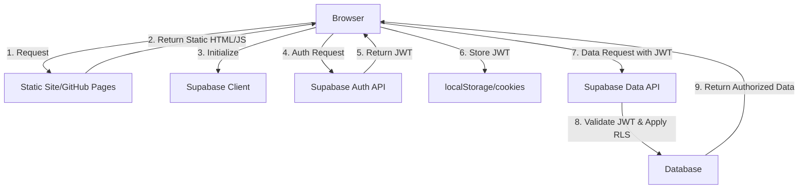

# Security Analysis: Supabase Authentication in Static Sites

## 1. Introduction

This document provides a security-focused analysis of the Supabase authentication implementation in the Martin C Scott portfolio website. As a static site deployed to GitHub Pages, this implementation faces unique security challenges that differ from traditional server-rendered applications with authentication.

## 2. Authentication Security Model



### Security Boundaries

- **Client-Side Boundary**: All code runs in the user's browser
- **API Boundary**: Supabase APIs enforce access control
- **No Server Boundary**: No application server to enforce security rules

## 3. Vulnerability Analysis

### 3.1 Client-Side Authentication Vulnerabilities

| Vulnerability | Description | Risk Level | Mitigation |
|---------------|-------------|------------|------------|
| Client-Side Redirect Bypass | Users can view protected page HTML by disabling JavaScript | Medium | Don't include sensitive data in static HTML |
| Public API Keys | Supabase anon keys are visible in client code | Medium | Implement proper Row Level Security (RLS) policies |
| Token Storage | JWTs stored in localStorage can be vulnerable to XSS | High | Use secure cookie options where possible |
| CSRF Attacks | Authentication forms may be vulnerable to CSRF | Medium | Implement anti-CSRF tokens |
| Network Interception | Auth tokens could be intercepted in transit | Medium | Ensure HTTPS-only deployment |

### 3.2 API-Level Vulnerabilities

| Vulnerability | Description | Risk Level | Mitigation |
|---------------|-------------|------------|------------|
| Missing RLS Policies | Data accessible without proper RLS rules | High | Implement comprehensive RLS policies |
| Overpermissive API Keys | Anon key with too many permissions | High | Restrict anon key permissions to minimum |
| JWT Validation Issues | Improper validation of JWT tokens | High | Ensure proper JWT validation on Supabase side |
| Long Token Expiry | Long-lived tokens increase risk if compromised | Medium | Configure shorter token expiry times |

## 4. Current Implementation Analysis

### 4.1 Strengths

- **SSR/Build Handling**: Uses mock client during build to prevent API calls
- **Error Handling**: Comprehensive error handling for authentication failures
- **Client-Side Redirects**: Properly redirects unauthenticated users
- **OAuth Implementation**: Correctly implements OAuth authentication flow

### 4.2 Weaknesses

- **Client-Side Protection Only**: Relies solely on client-side authentication checks
- **No CSRF Protection**: No explicit CSRF protection mechanisms
- **Potential XSS Vulnerability**: Authentication state stored in localStorage
- **Limited Session Management**: Basic session handling without advanced options

## 5. Security Best Practices for Static Site Authentication

### 5.1 Supabase-Specific Best Practices

- **Implement RLS Policies**: Define granular Row Level Security policies
  ```sql
  -- Example RLS policy that only allows users to access their own data
  CREATE POLICY "Users can only access their own data"
  ON public.user_data
  FOR ALL
  USING (auth.uid() = user_id);
  ```

- **Minimize Anon Key Permissions**: Restrict anonymous key to only necessary operations
- **Enable Secure Auth Settings**:
  - Email confirmation required
  - Strong password policies
  - Rate limiting for auth attempts

### 5.2 General Static Site Auth Best Practices

- **Don't Include Sensitive Data in HTML**: Keep protected content in API responses only
- **Use HTTPS Only**: Ensure all authentication happens over HTTPS
- **Implement CSP Headers**: Add Content Security Policy headers to prevent XSS
- **Consider Auth Proxy**: For highly sensitive applications, consider an authentication proxy

## 6. Recommended Security Improvements

### 6.1 Short-Term Improvements

1. **Add CSRF Protection**:
   ```javascript
   // Generate CSRF token
   const csrfToken = crypto.randomUUID();
   localStorage.setItem('csrfToken', csrfToken);
   
   // Add to form
   const tokenInput = document.createElement('input');
   tokenInput.type = 'hidden';
   tokenInput.name = 'csrf_token';
   tokenInput.value = csrfToken;
   form.appendChild(tokenInput);
   ```

2. **Implement Proper Error Handling**:
   ```javascript
   try {
     const { error } = await supabase.auth.signInWithPassword({
       email,
       password
     });
     
     if (error) {
       // Log error type but don't expose details to user
       console.error('Auth error:', error);
       
       // Show generic message to user
       showError('Authentication failed. Please check your credentials.');
     }
   } catch (error) {
     // Handle unexpected errors
     console.error('Unexpected auth error:', error);
     showError('An unexpected error occurred. Please try again later.');
   }
   ```

3. **Add Content Security Policy**:
   ```html
   <meta http-equiv="Content-Security-Policy" content="default-src 'self'; connect-src 'self' https://*.supabase.co; script-src 'self';">
   ```

### 6.2 Long-Term Improvements

1. **Consider Server-Side Authentication**:
   - Migrate to a hosting platform that supports server-side processing
   - Implement server middleware for authentication checks

2. **Implement JWK Rotation**:
   - Configure Supabase to rotate JWT signing keys regularly
   - Update application to handle key rotation gracefully

3. **Add Multi-Factor Authentication**:
   - Implement second factor authentication for sensitive operations
   - Integrate with Supabase Auth MFA capabilities

4. **Implement Audit Logging**:
   - Log all authentication events
   - Set up monitoring for suspicious authentication activities

## 7. Conclusion

The current Supabase authentication implementation provides a functional authentication system within the constraints of a static site. However, it has inherent security limitations that should be understood and mitigated.

The most critical security measure is implementing proper Row Level Security policies in Supabase, as this provides a defense-in-depth approach where data is protected even if the client-side authentication is bypassed.

For highly sensitive applications requiring strong security guarantees, consider migrating to a hosting platform that supports server-side authentication checks, as this provides a more robust security model than is possible with a purely static site.