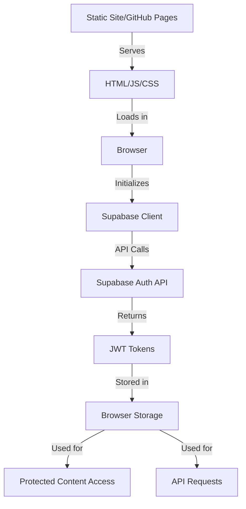
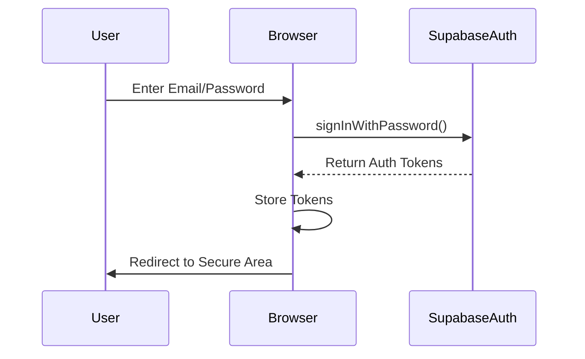
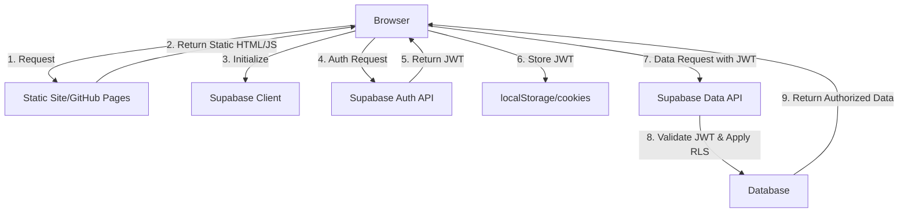

# Supabase Authentication Documentation Index

## Overview

This documentation set provides a comprehensive analysis of the Supabase authentication implementation in the Martin C Scott portfolio website, a static site deployed to GitHub Pages. The documentation is organized into several documents, each focusing on different aspects of the authentication system.

## Document Structure

### 1. [Executive Summary](./supabase-auth-executive-summary.md)

A concise overview of the authentication system, key findings, and recommendations. This is the best starting point for understanding the authentication implementation at a high level.

**Key sections:**
- Authentication Architecture
- Security Assessment
- Implementation Strengths
- High-Priority Recommendations
- Best Practices

### 2. [Authentication System Analysis](./supabase-auth-system-analysis.md)

A detailed analysis of the authentication system implementation, including architecture, flows, and components.

**Key sections:**
- Static Site Authentication Architecture
- Supabase Client Implementation
- Authentication Flows
- Protected Content Implementation
- User Experience Considerations
- Recommendations for Improvement

### 3. [Security Analysis](./supabase-auth-security-analysis.md)

A security-focused analysis of the authentication implementation, including vulnerability assessment and security best practices.

**Key sections:**
- Authentication Security Model
- Vulnerability Analysis
- Current Implementation Analysis
- Security Best Practices
- Recommended Security Improvements

### 4. [Implementation Recommendations](./supabase-auth-implementation-recommendations.md)

Practical recommendations for improving the authentication system, including code examples and implementation guidance.

**Key sections:**
- Security Enhancements
- User Experience Improvements
- Code Structure Improvements
- Testing Implementation

### 5. [Analysis Plan](./auth-system-analysis-plan.md)

The original plan for analyzing the authentication system, outlining the approach and methodology.

**Key sections:**
- Static Site Authentication Context
- Supabase Client Setup
- Authentication Flows
- Protected Content
- Security Analysis
- Implementation Recommendations

## Key Diagrams

### Authentication Architecture

### Authentication Flows

### Security Boundaries

## Key Recommendations

1. **Implement Row Level Security (RLS)** - Define granular data access policies in Supabase
2. **Centralize Authentication Logic** - Create a dedicated authentication service
3. **Enhance Form Validation** - Add client-side validation for authentication forms
4. **Add CSRF Protection** - Implement token-based CSRF protection for authentication forms
5. **Improve Token Security** - Consider more secure token storage options

## How to Use This Documentation

1. Start with the [Executive Summary](./supabase-auth-executive-summary.md) for a high-level overview
2. Review the [Authentication System Analysis](./supabase-auth-system-analysis.md) for detailed understanding
3. Examine the [Security Analysis](./supabase-auth-security-analysis.md) for security considerations
4. Use the [Implementation Recommendations](./supabase-auth-implementation-recommendations.md) for practical guidance

## Additional Resources

- [Supabase Authentication Documentation](https://supabase.com/docs/guides/auth)
- [Supabase Row Level Security Guide](https://supabase.com/docs/guides/auth/row-level-security)
- [JWT Security Best Practices](https://auth0.com/blog/a-look-at-the-latest-draft-for-jwt-bcp/)
- [OWASP Authentication Best Practices](https://cheatsheetseries.owasp.org/cheatsheets/Authentication_Cheat_Sheet.html)