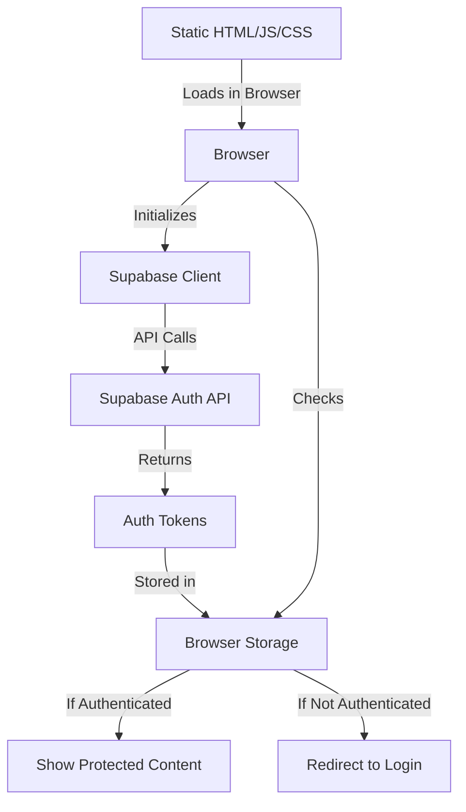
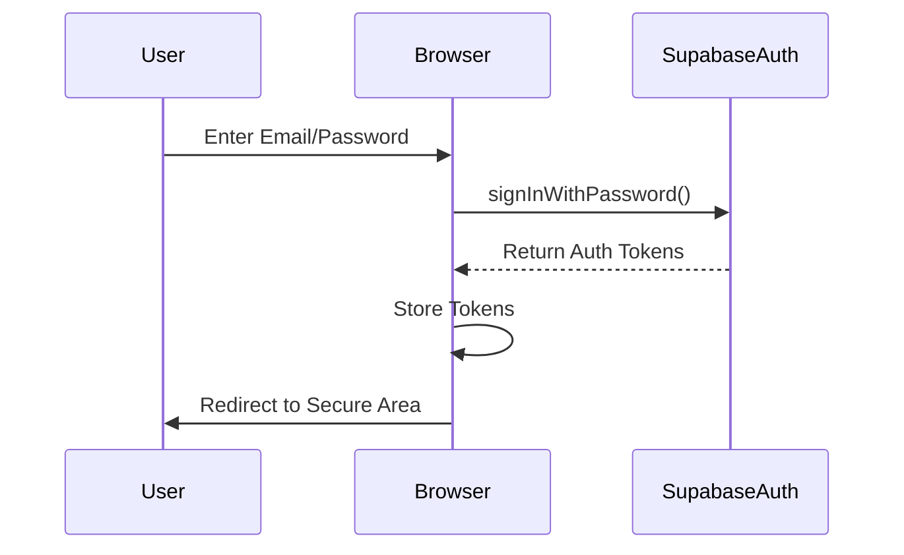
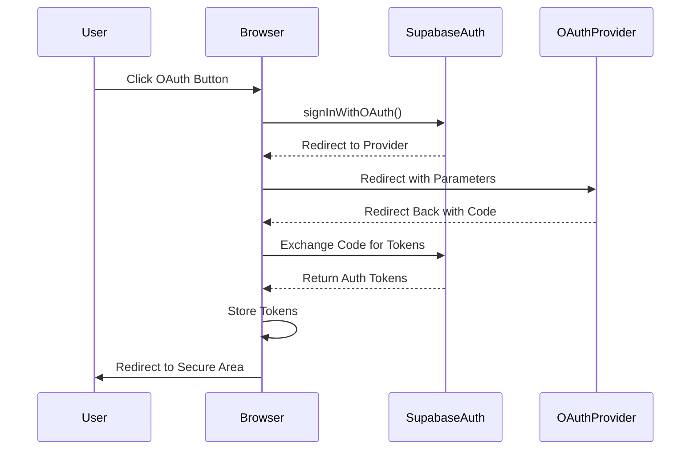
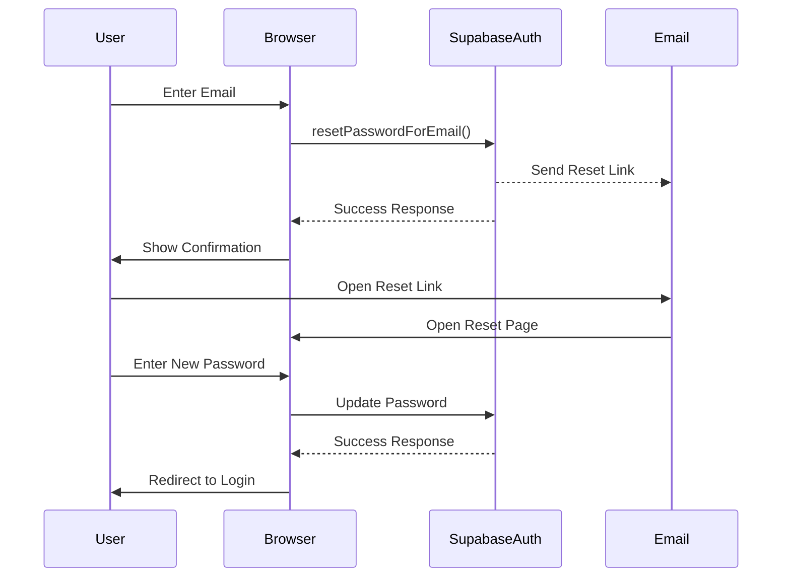

# Supabase Authentication System Analysis

## 1. Overview

This document analyzes the Supabase authentication implementation in the Martin C Scott portfolio website, which is built with Astro and deployed to GitHub Pages as a static site. This context creates unique considerations for authentication that differ from traditional server-rendered applications.

## 2. Static Site Authentication Architecture



### Key Characteristics

- **Client-Side Only**: All authentication logic runs in the browser after the static site is loaded
- **No Server Middleware**: No server-side code to enforce authentication rules
- **Browser Storage**: Authentication state stored in browser (localStorage/cookies)
- **API-Based**: Direct communication between browser and Supabase Auth API

## 3. Supabase Client Implementation

The Supabase client is implemented in `src/utils/supabase.js` with specific considerations for a static site:

```javascript
// During build/SSR, use a mock client to avoid errors
if (import.meta.env.SSR) {
  supabaseClient = {
    auth: {
      signInWithPassword: async () => ({ data: null, error: null }),
      // Other mock methods...
    }
  };
} else {
  // In the browser, use the real Supabase client
  supabaseClient = createClient(supabaseUrl, supabaseAnonKey);
}
```

### Key Implementation Details

- **Environment Variables**: Uses public environment variables with the `PUBLIC_` prefix
- **SSR Handling**: Uses a mock client during build/SSR to prevent API calls during static generation
- **Fallbacks**: Provides fallback values for environment variables to prevent build failures
- **Error Handling**: Includes comprehensive error handling with fallback client on initialization failure

## 4. Authentication Flows

### 4.1 Email/Password Authentication



**Implementation in `login.astro`**:
```javascript
const { error } = await supabase.auth.signInWithPassword({
  email,
  password
});

if (error) throw error;
        
// Redirect to secure area or home page
window.location.href = '/secure';
```

### 4.2 OAuth Authentication



**Implementation in `login.astro`**:
```javascript
const { error } = await supabase.auth.signInWithOAuth({
  provider: 'github',
});

if (error) throw error;
```

### 4.3 Password Reset Flow



**Implementation in `reset-password.astro`**:
```javascript
const { error } = await supabase.auth.resetPasswordForEmail(email, {
  redirectTo: `${window.location.origin}/auth/login`
});

if (error) throw error;
```

## 5. Protected Content Implementation

The secure area (`src/pages/secure/index.astro`) implements client-side protection:

```javascript
async function checkAuthStatus() {
  try {
    const { data, error } = await supabase.auth.getUser();
    
    if (error || !data?.user) {
      // Redirect to login if not authenticated
      window.location.href = `/${currentLocale}/auth/login`;
      return;
    }
    
    // Show user info
    document.getElementById('user-email').textContent = data.user.email;
    document.getElementById('user-info').classList.remove('hidden');
    document.getElementById('loading').classList.add('hidden');
  } catch (error) {
    console.error('Auth check error:', error);
    alert(`${translations.authError}: ${error.message}`);
  }
}
```

### Key Characteristics

- **Client-Side Checks**: Authentication verification happens in the browser
- **Redirect Pattern**: Unauthenticated users are redirected to the login page
- **Initial Loading State**: Shows a loading state until authentication is verified
- **No Server Enforcement**: The page is accessible as a static resource regardless of auth status

## 6. Security Considerations

### 6.1 Limitations of Static Site Authentication

- **Client-Side Enforcement**: Authentication rules are enforced by JavaScript in the browser
- **Visible HTML**: The HTML of protected pages is accessible before the redirect occurs
- **JavaScript Dependency**: Protection fails if JavaScript is disabled
- **Public API Keys**: Supabase anonymous keys are exposed in the client-side code

### 6.2 Mitigations and Best Practices

- **No Sensitive Data in Initial HTML**: Protected pages should not include sensitive data in the static HTML
- **API Security Rules**: Rely on Supabase Row Level Security (RLS) for data protection
- **Token Validation**: Supabase validates tokens on API requests
- **HTTPS Only**: Ensure the site is served over HTTPS to protect authentication tokens
- **Short Token Expiry**: Configure shorter expiry times for authentication tokens

## 7. User Experience Considerations

- **Loading States**: Appropriate loading indicators during authentication checks
- **Error Handling**: Clear error messages for authentication failures
- **Internationalization**: Translations for authentication components
- **Form Validation**: Client-side validation for authentication forms
- **Responsive Design**: Mobile-friendly authentication forms

## 8. Recommendations for Improvement

### 8.1 Security Enhancements

- **Implement Supabase RLS Policies**: Ensure data is protected at the database level
- **Add CSRF Protection**: Implement additional CSRF protection for authentication forms
- **Consider Auth Middleware**: For sensitive applications, consider a hosting platform that supports server-side authentication

### 8.2 User Experience Enhancements

- **Implement Remember Me**: Add option to extend session duration
- **Enhance Form Validation**: Add more robust client-side validation
- **Improve Error Messages**: Provide more specific error messages for authentication failures
- **Add Social Login Options**: Consider additional OAuth providers

### 8.3 Code Structure Improvements

- **Centralize Auth Logic**: Create a dedicated authentication service
- **Add TypeScript Types**: Improve type safety for authentication functions
- **Implement Testing**: Add unit and integration tests for authentication flows

## 9. Conclusion

The Supabase authentication implementation in this static site provides a functional authentication system within the constraints of a static hosting environment. While it has inherent security limitations compared to server-rendered applications, it follows best practices for client-side authentication and can be secure when combined with proper data access controls at the API level.

The key to security in this model is understanding that authentication in the browser only controls what the user sees, while data security must be enforced by the Supabase backend through Row Level Security policies.